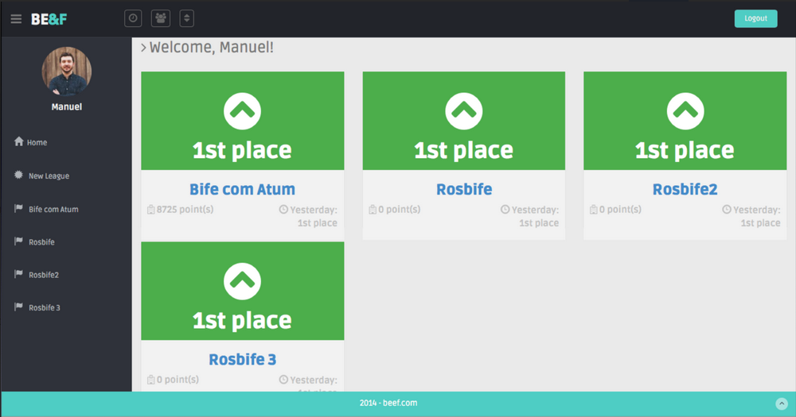
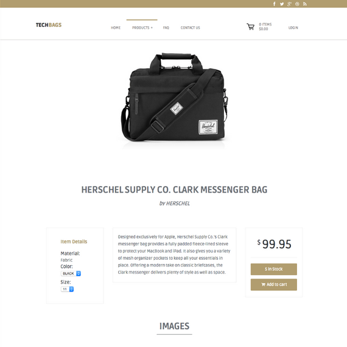
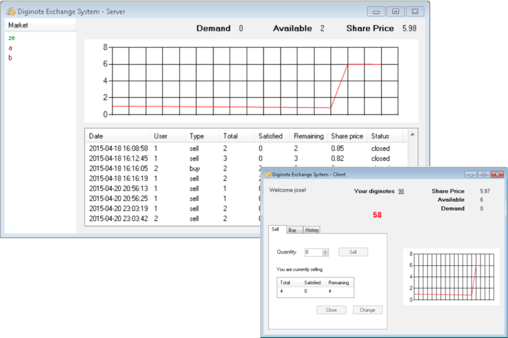
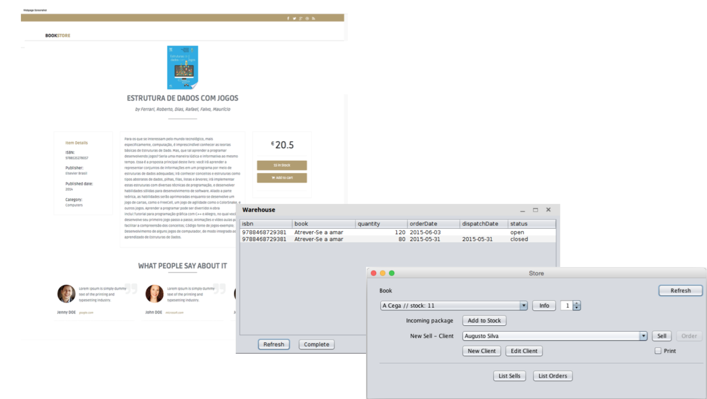
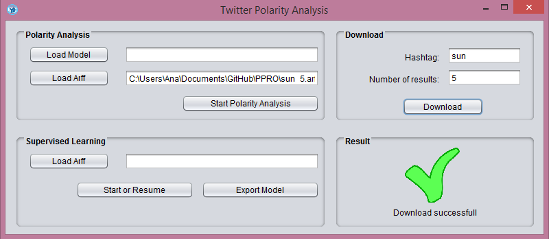
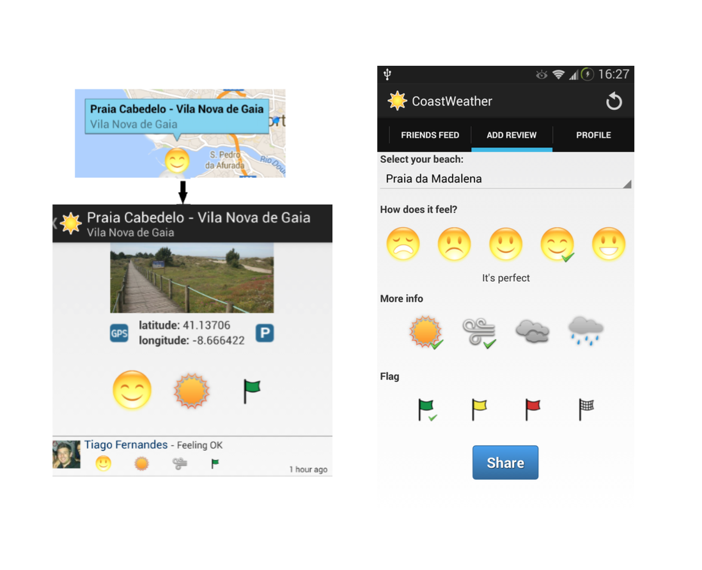
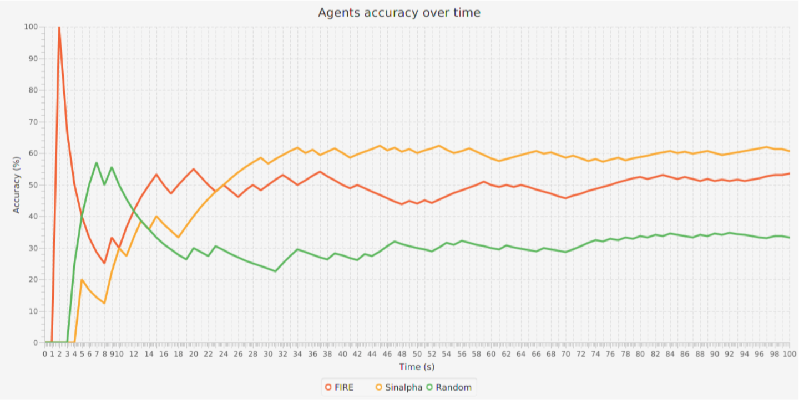
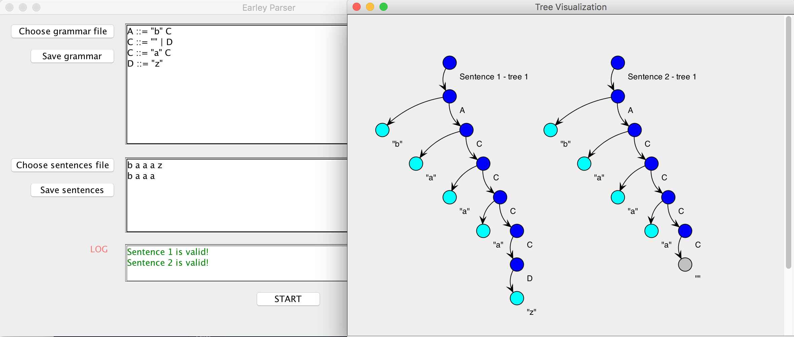
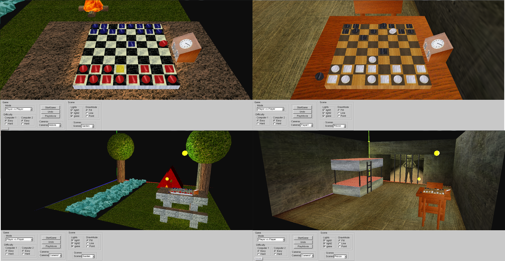
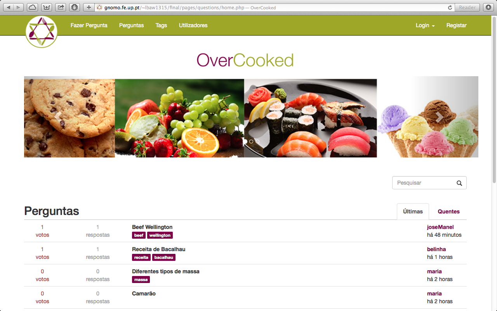

### [**HealthSuggestions**](https://github.com/tiagoaf5/HealthSuggestions)
A Google Chrome extension to help laypersons search the Web for health information. The extension has support of a server to provide suggestions and to log some usage information.

Chrome Extensions, JavaScript, JQuery, IndexedDB, CSS, HTML, Python, Django, Postgresql

  

### [**Beef**](https://github.com/tiagoaf5/Beef)
Beef stands for Bet & Friends and it's a platform for friends to bet against each-other in games of the major football leagues.

Ruby on Rails, JavaScript, JQuery, CSS, HTML

  

### [**TechBags**](https://github.com/dvn123/SINF)
An online store for premium laptop bags. Backend connected with [Primavera ERP](http://www.primaverabss.com/).

C#, JavaScript, AngularJS, CSS, HTML

  

### [**Elections Formal**](https://github.com/augustocravosilva/Elections-MFES)
Modeling Project for a safe electronic Elections system.

VDM++

###  [**Diginote-Exchange-System**](https://github.com/tiagoaf5/Diginote-Exchange-System)
.NET Remoting project to buy and sell 'diginotes' (similar to bitcoins). There is a main server representing the stock market and then there is the client app that allows each client to buy, sell, and watch the market evolving.

C#, .NET Remoting

  

###  [**BookShop**](https://github.com/augustocravosilva/BookShop)
This project is threefold: there is a central book storage (Warehouse), a bookshop and a website for online orders. The Warehouse server is not always online so it is used a queue for the communication with it. The store and the website use the same API that can interact with the Warehouse and order books if in need.

Java EE, JMS, JavaDB, JavaScript, AngularJS, CSS, HTML

  

###  [**Sentiment Analysis**](https://github.com/AnaSousa/Sentiment-Analysis)
Sentiment Analysis of tweets by topic chosen by the user. First the user needs to teach the model and then user can specify an hashtag and the application will guess if people are talking good or bad things about that hashtag. To help the users with the classification, a prolog engine was built that pre-classifies the sentence based on the words it contains (positive vs. negative words + negating sentence), the user can then agree or disagree with this pre-classification. The interaction with the user is through a Java Swing interface. The tweets are downloaded with a Python script.

Java, Python, Prolog

  

### [**CoastWeather**](https://github.com/augustocravosilva/CoastWeather)
Collaborative Android application for weather in Portuguese beaches. It allows users to specify information about the weather, about the current flag and how they feel in that conditions. The beaches are presented in a map and the expected beach feeling is calculated based on the multiple users reports.

Android, PHP, SQLite

  

### [**Distributed Backup**](https://github.com/tiagoaf5/Distributed-backup)
A distributed backup service for a local area network (LAN). The idea is to use the unused disk space of the computers in a LAN for backing up files in other computers in the same LAN. The service is provided by servers, one per computer, in an environment that is assumed cooperative (rather than hostile). Each server retains control over its own disks and, if needed, may reclaim the space it made available for backing up other computers' files.

Java

### [**Computational Trust models**](https://github.com/dvn123/Computational-Trust-models)
 The purpose of this assignment was to compare some computational trust models and the interaction between agents. It was created a game where there is an agent who asks questions, there are some who answers and some agents who have knowledge in some fields (wise agents). At each round of the game a question is asked, and each answer agent asks the question to the wise agent it believes is the best to answer that kind of question and then answers back to the question agent. With this approach each answer agent has a different algorithm so, in theory, the agent who has the best ratio has the best algorithm.

 Java, Java FX, Jade (agents framework)

 

   
 

### [**Earley Parser**](https://github.com/tiagoaf5/Earley-Parser)

 Tool that implements a grammar parser based on Earley algorithm. The tool's inputs are a grammar and a list of tokens. The tool provides insights about how the list of tokens matches the grammar.

 Java, RE

 

   
 

### [**Gounki-3D**](https://github.com/tiagoaf5/Gounki-3D)

 Gounki is an abstract strategy game in which pieces can combine and disperse to affect their movement possibilities. Played on an eight-by-eight square grid, the goal is to move one of your own pieces off the opposite end of the board while preventing your opponent from doing the same. The game's rules can be found [here](https://github.com/tiagoaf5/Gounki-3D/blob/master/gounki.pdf).

 The game's logic was implemented using Prolog. The 3D graphics and interface were done using OpenGL. This project was part of a previous project, so it was taken advantage of the Scene Graph engine implemented in the previous steps. The game can be played against another player or agains the computer (easy or hard).

 C++, OpenGL, Prolog

 

   
 

### [**OverCooked**](https://github.com/dvn123/overCooked)

Web platform for collaborative questions and answers about food and other related topics. (StackOverflow alike).

PHP, Postgresql, JavaScript, JQuery, CSS, HTML

  

